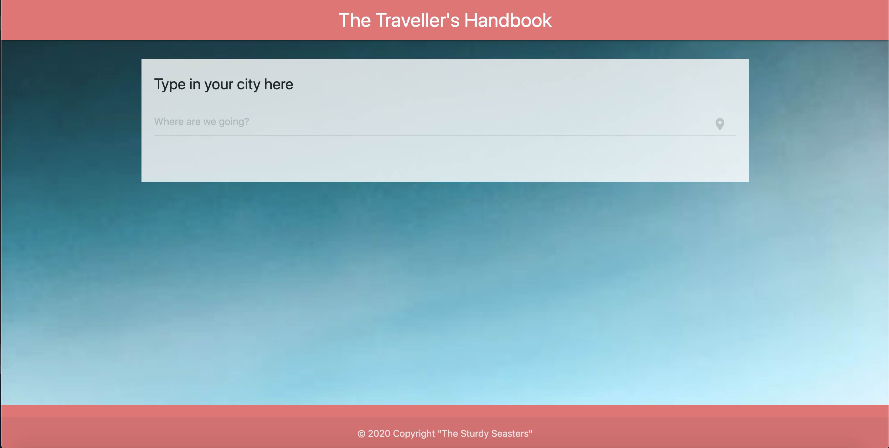

# The Traveller's Handbook
An app that provides basic information on a given city.

## Table of Contents 
* [Description](#Description)
* [Screenshots/Demo](#Screenshots/Demo)
* [Built With](#BuiltWith)
* [APIs Used](#APIsUsed)
* [License](#License)
* [Badges](#Badges)

## Description 
This is a web app that provides information on any given city to travellers. The app takes in the user's input on a given location and provides a brief description of the city, a picture of a location in the city, the current weather, relevant information (population, elevation, current time), as well as the exchange rate for that city's currency relative to USD. 

## Screenshots / Demo
The app opens to the landing page;

Upon Entering the name of the city you want to visit, the page adds the below information;

## Built With...
The app was built by using the below frameworks;
- Materialize - CSS Framework
- Jquery - JS Library

## APIs Used...
The app utilizes the below APIs;
- Geo BD
- Open Weather 
- Currency Exchange
- Trip Advisor
- Algolia

## License

MIT License

Copyright (c) [2020] [TheSturdySeesters]

Permission is hereby granted, free of charge, to any person obtaining a copy
of this software and associated documentation files (the "Software"), to deal
in the Software without restriction, including without limitation the rights
to use, copy, modify, merge, publish, distribute, sublicense, and/or sell
copies of the Software, and to permit persons to whom the Software is
furnished to do so, subject to the following conditions:

The above copyright notice and this permission notice shall be included in all
copies or substantial portions of the Software.

THE SOFTWARE IS PROVIDED "AS IS", WITHOUT WARRANTY OF ANY KIND, EXPRESS OR
IMPLIED, INCLUDING BUT NOT LIMITED TO THE WARRANTIES OF MERCHANTABILITY,
FITNESS FOR A PARTICULAR PURPOSE AND NONINFRINGEMENT. IN NO EVENT SHALL THE
AUTHORS OR COPYRIGHT HOLDERS BE LIABLE FOR ANY CLAIM, DAMAGES OR OTHER
LIABILITY, WHETHER IN AN ACTION OF CONTRACT, TORT OR OTHERWISE, ARISING FROM,
OUT OF OR IN CONNECTION WITH THE SOFTWARE OR THE USE OR OTHER DEALINGS IN THE
SOFTWARE.

## Badges

